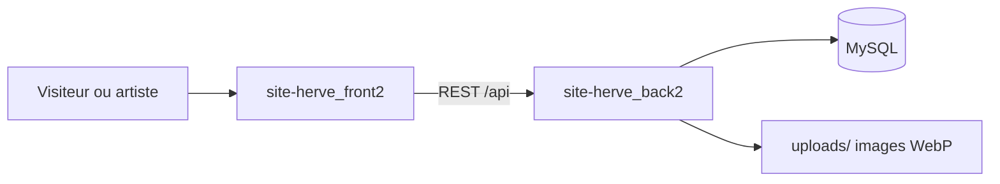

> **English summary** — REST API for a full-stack artist portfolio and CMS built with Node.js, Express, MySQL, and TypeScript. JWT auth with refresh rotation, image pipeline (Sharp/WebP), Zod validation, anti-spam, and a complete admin surface. Requires the companion frontend: [site-herve_front2](https://github.com/Mattia-FR/site-herve_front2).

# API site Hervé — back2

Backend REST pour un site d'artiste peintre : articles, galerie, contact, livre d'or et administration sécurisée par JWT.

Ce dépôt couvre la **couche backend**. L'application complète nécessite aussi le frontend [site-herve_front2](https://github.com/Mattia-FR/site-herve_front2).

## Fonctionnalités clés

### API publique

- Profil artiste et paramètres page d'accueil (`GET /api/artist/`)
- Articles publiés (liste, aperçu accueil, détail par slug ou id)
- Galerie par catégories (carousel, filtre par slug)
- Contact et livre d'or avec honeypot anti-spam et modération

### API admin (JWT Bearer)

| Domaine | Capacités |
|---------|-----------|
| Stats | Compteurs agrégés (articles, catégories, galerie, messages, livre d'or) |
| Articles | CRUD + upload images contenu et image à la une |
| Images | CRUD + upload multipart + association catégories |
| Catégories | CRUD avec ordre d'affichage |
| Messages | Liste, détail, changement de statut, suppression |
| Livre d'or | Modération (pending / approved / spam) |
| Profil | `GET/PUT /api/admin/users/me` |
| Paramètres site | `GET/PUT /api/admin/site` — hero, citation (page d'accueil) |

### Sécurité et traitement média

- JWT access (15 min) + refresh rotatif en cookie httpOnly (hash Argon2id en base)
- Helmet (CSP), CORS, rate limiting, validation Zod
- Pipeline Sharp : variants WebP multi-tailles, rotation EXIF, validation magic bytes (max 10 Mo)

## Architecture



| Composant | Rôle |
|-----------|------|
| **front2** | SPA React, pages publiques, admin |
| **back2** (ce dépôt) | API REST, auth JWT, uploads, modération |
| **MySQL** | Données métier (7 tables + site_settings) |
| **uploads/** | Fichiers image locaux (gallery/, content/, featured/) |

## Stack technique


- **Express 4** + **TypeScript** (strict, ES2022)
- **MySQL2** — pool de connexions, requêtes paramétrées
- **JWT** + **Argon2id** — auth access/refresh, mots de passe et hash refresh
- **Multer** + **Sharp** + **file-type** — uploads, variants WebP, magic bytes
- **Zod 4** — validation body/query/params
- **Helmet**, **express-rate-limit**, **CORS** — sécurité HTTP
- **Winston** — logs structurés (JSON en prod)
- **Biome** — lint et format

## Démarrage rapide

Prérequis : **Node.js**, **MySQL** local, le frontend cloné pour tester l'application complète.

```bash
# Terminal 1 — backend (ce dépôt)
cd site-herve_back2
npm install && cp .env.sample .env
# Éditer .env (MySQL + secrets JWT)
npm run init:db   # destructif — dev uniquement
npm run dev       # http://localhost:4242

# Terminal 2 — frontend
cd site-herve_front2
npm install && cp .env.example .env
npm run dev       # http://localhost:5173
```

Générer des secrets JWT (≥ 32 bytes base64) :

```bash
node -e "console.log(require('crypto').randomBytes(32).toString('base64'))"
```

API par défaut : `http://localhost:4242` — préfixe routes métier : `/api`.

## Scripts

| Script | Description |
|--------|-------------|
| `npm run dev` | nodemon + ts-node |
| `npm run build` | `tsc` → `dist/` |
| `npm run start` | `node dist/index.js` (production) |
| `npm run init:db` | `ts-node init.ts` — schema + seeds |
| `npm run check` / `lint` / `format` | Biome |

## Variables d'environnement

Voir [`.env.sample`](./.env.sample).

| Variable | Obligatoire | Usage |
|----------|-------------|-------|
| `DB_HOST`, `DB_USER`, `DB_PASSWORD`, `DB_NAME`, `DB_PORT` | Oui | Connexion MySQL |
| `ACCESS_TOKEN_SECRET`, `REFRESH_TOKEN_SECRET` | Oui | JWT (≥ 32 bytes base64 chacun) |
| `CORS_ORIGIN` | Recommandé | URL du front (défaut `http://localhost:5173`) |
| `PORT` | Non | Port API (défaut `4242`) |
| `API_URL`, `IMAGE_BASE_URL` | Non | URLs publiques (CSP, liens images) |
| `NODE_ENV` | Non | `development` / `production` |
| `LOG_LEVEL`, `LOG_DIR` | Non | Configuration Winston |

## Routes principales

### Racine et fichiers

| Méthode | Route | Auth |
|---------|-------|------|
| GET | `/` | Non |
| GET | `/uploads/*` | Non (statique) |
| GET | `/api/health` | Non → `{ status: "ok" }` |

### Auth

| Méthode | Route | Description |
|---------|-------|-------------|
| POST | `/api/auth/login` | `{ email, password }` → `{ accessToken, user }` + cookie refresh |
| POST | `/api/auth/refresh` | Cookie refresh → `{ accessToken }` |
| POST | `/api/auth/logout` | 204, invalide refresh |

### Public

| Méthode | Route |
|---------|-------|
| GET | `/api/artist/` |
| GET | `/api/articles/homepage-preview` |
| GET | `/api/articles/published` |
| GET | `/api/articles/published/id/:id` |
| GET | `/api/articles/published/slug/:slug` |
| GET | `/api/images/gallery/carousel` |
| GET | `/api/images/gallery?category=slug` |
| GET | `/api/categories/`, `/api/categories/:id` |
| POST | `/api/messages/` (honeypot `website`) |
| GET | `/api/guestbook/`, POST `/api/guestbook/` (honeypot `website`) |

### Admin (Bearer JWT)

Préfixe `/api/admin` — header `Authorization: Bearer <accessToken>`.

| Domaine | Routes principales |
|---------|-------------------|
| Stats | `GET /stats` |
| Articles | CRUD + `POST .../content-images`, `POST .../featured-image` |
| Images | CRUD + `POST /` (multipart) + `PUT /:id/categories` |
| Catégories | CRUD |
| Messages | liste, détail, PATCH statut, DELETE |
| Livre d'or | liste, PATCH statut, DELETE |
| Profil | `GET/PUT /users/me` |
| Site | `GET/PUT /site` |

## Structure du code

Architecture **MVC** : `routes → controllers → models → MySQL`.

```
src/
├── app.ts                 # Middlewares globaux, rate limits, static /uploads
├── config/                # argon2, helmet, honeypot, multer, startup, uploadsPaths
├── routes/                # Routeurs publics + admin (sous-routers par domaine)
├── controllers/           # Logique HTTP (public + *AdminController)
├── models/                # Accès SQL — modèles publics et admin séparés
├── middlewares/           # auth, validation Zod, errorHandler, honeypot, magic bytes
├── validation/            # Schémas Zod par domaine
├── errors/                # Hiérarchie AppError
├── types/                 # Types TS (artist, stats, siteSettings…)
└── utils/                 # asyncHandler, sendError, processImage, helpers
```

Tables MySQL : `users`, `articles`, `images`, `categories`, `images_categories`, `contact_messages`, `guestbook_entries`, `site_settings`.

## Points techniques

- **Séparation public / admin** — routeurs, controllers et modèles distincts par couche
- **Error handler centralisé** — hiérarchie `AppError`, gestion Multer et erreurs MySQL (`ER_DUP_ENTRY`, etc.)
- **Contrat d'erreurs aligné frontend** — `{ success: false, code, message, details? }`
- **Pipeline images** — upload → magic bytes → Sharp (variants WebP) → stockage JSON en DB, nettoyage en cas d'erreur
- **Anti-spam** — honeypot silencieux (réponse 201 factice si bot), rate limiting par route
- **Fail-fast au démarrage** — vérification secrets JWT, connexion DB, création dossiers `uploads/`
- **Observabilité** — Winston structuré, `requestId` par requête, logs HTTP

## Déploiement production

Variables essentielles : `NODE_ENV=production`, `CORS_ORIGIN` (URL du front), `IMAGE_BASE_URL` (URL publique pour les images), secrets JWT forts.

En production, `trust proxy` est activé automatiquement (IP réelle et cookies `secure` derrière Nginx ou équivalent).

**Reverse proxy (Nginx)** — schéma typique :

- `location /api` → proxy vers Node (port `4242` par défaut)
- `location /uploads` → proxy ou alias vers le dossier `uploads/` du projet

**Checklist go-live :**

- [ ] `CORS_ORIGIN` = URL exacte du front
- [ ] MySQL initialisée (première fois uniquement — `init:db` est destructif)
- [ ] Sauvegarde planifiée : base MySQL + dossier `uploads/`
- [ ] Health check : `GET /api/health`
