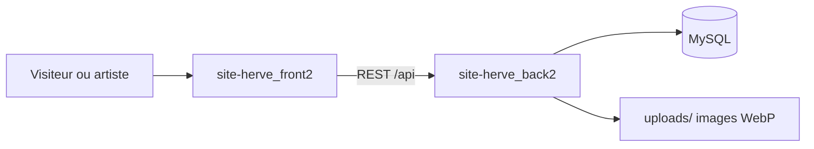

> **English summary** — Production-ready REST API for a full-stack artist portfolio and CMS built with Node.js, Express, MySQL, and TypeScript. JWT auth with refresh rotation, Sharp/WebP image pipeline, Zod validation, anti-spam (honeypot + rate limiting), structured logging (Winston), and optional SMTP notifications. Powers the live site [herve-petit.com](https://www.herve-petit.com). Companion frontend: [site-herve_front2](https://github.com/Mattia-FR/site-herve_front2).

# API site Hervé — back2

Backend REST d'un CMS sur mesure pour un artiste peintre — articles, galerie, contact, livre d'or et administration sécurisée par JWT. **En production** derrière [herve-petit.com](https://www.herve-petit.com) (reverse proxy Nginx).

Refonte (v2) d'une première version (`Back` / `Front`) en TypeScript strict : Zod 4, pipeline Sharp, Winston, contrat d'erreurs partagé avec le frontend, séparation public/admin au niveau MVC.

Ce dépôt couvre la **couche backend**. L'application complète nécessite aussi le frontend [site-herve_front2](https://github.com/Mattia-FR/site-herve_front2).

## Points forts techniques

- **Auth JWT robuste** — access token 15 min + refresh rotatif en cookie httpOnly, hash Argon2id en base
- **Sécurité HTTP** — Helmet (CSP), CORS, rate limiting par route, honeypot silencieux sur contact et livre d'or
- **Pipeline média** — Multer → validation magic bytes → Sharp (3 variants WebP) → rollback en cas d'erreur
- **Architecture MVC stricte** — routeurs, controllers et models **public vs admin séparés**
- **Validation Zod 4** — body/query/params, schémas synchronisés avec Front2
- **Gestion d'erreurs centralisée** — hiérarchie `AppError`, contrat `{ success, code, message, details? }`
- **Observabilité** — Winston JSON en prod, `requestId` par requête, health check MySQL (`GET /api/health`), remontée d'erreurs frontend optionnelle (`POST /api/client-logs` si `CLIENT_LOG_ENABLED=true`)
- **Production-ready** — fail-fast au démarrage, `trust proxy`, déploiement Nginx documenté
- **Qualité de code** — TypeScript strict, Biome — pas de suite de tests automatisée (choix assumé, comme Front2)

## Fonctionnalités clés

### API publique

- Profil artiste et paramètres page d'accueil (`GET /api/artist/`)
- Articles publiés (liste, aperçu accueil, détail par slug ou id)
- Galerie par catégories (carousel, filtre par slug)
- Contact et livre d'or avec honeypot anti-spam, modération et **notifications email** (opt-in)

### API admin (JWT Bearer)

| Domaine | Capacités |
|---------|-----------|
| Stats | Compteurs agrégés (articles, catégories, galerie, messages, livre d'or) |
| Articles | CRUD + upload images contenu et image à la une, liste paginée |
| Images | CRUD + upload multipart + association catégories, liste paginée |
| Catégories | CRUD avec ordre d'affichage |
| Messages | Liste paginée, détail, PATCH statut, suppression |
| Livre d'or | Modération paginée (pending / approved / spam), PATCH statut |
| Profil | `GET/PUT /api/admin/users/me` — username, email, mot de passe, tagline, bio, hero_text, quote_text, quote_author, photo de profil |

## Architecture



| Composant | Rôle |
|-----------|------|
| **front2** | SPA React, pages publiques, admin |
| **back2** (ce dépôt) | API REST, auth JWT, uploads, modération |
| **MySQL** | Données métier (7 tables) |
| **uploads/** | Fichiers image locaux (gallery/, content/, featured/) |

## Stack technique


- **Express 4** + **TypeScript** (strict, ES2022)
- **MySQL2** — pool de connexions, requêtes paramétrées
- **JWT** + **Argon2id** — auth access/refresh, mots de passe et hash refresh
- **Multer** + **Sharp** + **file-type** — uploads, variants WebP, magic bytes
- **Zod 4** — validation body/query/params
- **Helmet**, **express-rate-limit**, **CORS** — sécurité HTTP
- **Winston** — logs structurés (JSON en prod)
- **Nodemailer** — notifications SMTP (contact, livre d'or)
- **Biome** — lint et format

## Démarrage rapide

Prérequis : **Node.js**, **MySQL** local, le frontend cloné pour tester l'application complète.

```bash
# Terminal 1 — backend (ce dépôt)
cd site-herve_back2
npm install && cp .env.sample .env
# Éditer .env (MySQL + secrets JWT)
npm run init:db   # destructif — dev uniquement
npm run dev       # http://localhost:4242

# Terminal 2 — frontend
cd site-herve_front2
npm install && cp .env.example .env
npm run dev       # http://localhost:5173
```

Générer des secrets JWT (≥ 32 bytes base64) :

```bash
node -e "console.log(require('crypto').randomBytes(32).toString('base64'))"
```

API par défaut : `http://localhost:4242` — préfixe routes métier : `/api`.

## Scripts

| Script | Description |
|--------|-------------|
| `npm run dev` | nodemon + ts-node |
| `npm run build` | `tsc` → `dist/` |
| `npm run start` | `node dist/index.js` (production) |
| `npm run init:db` | `ts-node init.ts` — schema + seeds |
| `npm run check` / `lint` / `format` | Biome |

## Variables d'environnement

Voir [`.env.sample`](./.env.sample).

| Variable | Obligatoire | Usage |
|----------|-------------|-------|
| `DB_HOST`, `DB_USER`, `DB_PASSWORD`, `DB_NAME`, `DB_PORT` | Oui | Connexion MySQL |
| `ACCESS_TOKEN_SECRET`, `REFRESH_TOKEN_SECRET` | Oui | JWT (≥ 32 bytes base64 chacun) |
| `CORS_ORIGIN` | Recommandé | URL du front (défaut `http://localhost:5173`) |
| `PORT` | Non | Port API (défaut `4242`) |
| `HOST` | Non | Interface d'écoute (défaut `127.0.0.1`, local only derrière Nginx) |
| `API_URL`, `IMAGE_BASE_URL` | Non | URLs publiques (CSP, liens images) |
| `NODE_ENV` | Non | `development` / `production` |
| `LOG_LEVEL`, `LOG_DIR` | Non | Configuration Winston |
| `CLIENT_LOG_ENABLED` | Non | Remontée d'erreurs client (`true` pour activer) |
| `EMAIL_ENABLED` | Non | Notifications email contact/livre d'or (`true` pour activer) |
| `SMTP_HOST`, `SMTP_PORT`, `SMTP_SECURE` | Si email activé (prod) | Serveur SMTP (ex. OVH : `ssl0.ovh.net`, port `587`, `SMTP_SECURE=false`) |
| `SMTP_USER`, `SMTP_PASS` | Si email activé (prod) | Identifiants SMTP |
| `SMTP_FROM` | Si email activé (prod) | Expéditeur, ex. `"Site Hervé Petit <contact@domaine.fr>"` |
| `NOTIFY_EMAIL` | Si email activé (prod) | Destinataire des alertes (l'artiste) |

En développement, laisser `EMAIL_ENABLED` absent ou `false` — aucune config SMTP requise.

Exemple production (OVH) :

```env
EMAIL_ENABLED=true
SMTP_HOST=ssl0.ovh.net
SMTP_PORT=587
SMTP_SECURE=false
SMTP_USER=contact@votredomaine.fr
SMTP_PASS=***
SMTP_FROM="Site Hervé Petit <contact@votredomaine.fr>"
NOTIFY_EMAIL=artiste@example.com
```

Lors d'un message contact ou d'une entrée livre d'or, l'artiste reçoit un email texte avec lien vers l'admin (`/admin/messages` ou `/admin/guestbook`). L'envoi est asynchrone : un échec SMTP n'empêche pas l'enregistrement en base.

## Routes principales

| Domaine | Préfixe | Auth | Exemples |
|---------|---------|------|----------|
| Health & static | `/`, `/uploads/*`, `/api/health` | Non | Liveness + fichiers WebP |
| Client logs | `/api/client-logs` | Non | POST remontée d'erreurs frontend (si `CLIENT_LOG_ENABLED=true`) |
| Auth | `/api/auth/*` | Non | login, refresh, logout |
| Public | `/api/artist`, `/api/articles`, `/api/images`, `/api/categories`, `/api/messages`, `/api/guestbook` | Non | Lecture + POST contact/livre d'or (honeypot `website`) |
| Admin | `/api/admin/*` | Bearer JWT | CRUD articles, images, catégories, modération, stats, profil |

Détail complet des endpoints dans les routeurs `src/routes/`.

## Structure du code

Architecture **MVC** : `routes → controllers → models → MySQL`.

```
src/
├── app.ts                 # Middlewares globaux, rate limits, static /uploads
├── config/                # argon2, helmet, honeypot, multer, startup, uploadsPaths
├── routes/                # Routeurs publics + admin (sous-routers par domaine)
├── controllers/           # Logique HTTP (public + *AdminController)
├── models/                # Accès SQL — modèles publics et admin séparés
├── middlewares/           # auth, validation Zod, errorHandler, honeypot, magic bytes
├── validation/            # Schémas Zod par domaine
├── errors/                # Hiérarchie AppError
├── types/                 # Types TS (artist, stats, users…)
└── utils/                 # asyncHandler, sendError, processImage, helpers
```

Tables MySQL : `users`, `articles`, `images`, `categories`, `images_categories`, `contact_messages`, `guestbook_entries`.

## Déploiement production

Site de référence en production : [herve-petit.com](https://www.herve-petit.com).

Variables essentielles : `NODE_ENV=production`, `CORS_ORIGIN` (URL du front), `IMAGE_BASE_URL` (URL publique pour les images), secrets JWT forts.

En production, `trust proxy` est activé automatiquement (IP réelle et cookies `secure` derrière Nginx ou équivalent).

**Reverse proxy (Nginx)** — schéma typique :

- `location /api` → proxy vers Node (port `4242` par défaut)
- `location /uploads` → proxy ou alias vers le dossier `uploads/` du projet

**Checklist go-live :**

- [ ] `CORS_ORIGIN` = URL exacte du front
- [ ] MySQL initialisée (première fois uniquement — `init:db` est destructif)
- [ ] Sauvegarde planifiée : base MySQL + dossier `uploads/`
- [ ] Health check : `GET /api/health`
